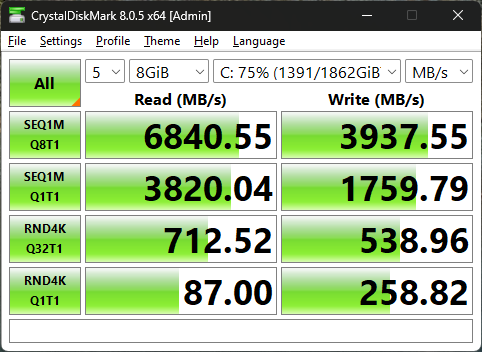

# mauder
This is a MAUDE data scraper for consolodating device data based on product code.

The utility will search subdirectories for any avialable information for the product codes provided and merge it into a single file.

# data

Maude data can be downloaded from the FDA's [MDR Data Files](https://www.fda.gov/medical-devices/medical-device-reporting-mdr-how-report-medical-device-problems/mdr-data-files).

The data downloaded from the website should be placed as indicated in the structure below.

```
.
└── mdr-data-files/
    ├── device
    |   ├── DEVICE.txt
    |   ├── DEVICE2023.txt
    |   ├── DEVICE2022.txt
    |   ├── ...
    |   └── DEVICEChange.txt
    ├── foitext
    |   ├── foitext.txt
    |   ├── foitext2023.txt
    |   ├── ...
    |   └── foitextChange.txt
    ├── patientproblemcode
    |   └── patientproblemcode.txt
    └── patientproblemdata
        └── patientproblemcodes.csv

```


NOTE: the 'patientproblemdata.zip' archive contains the file named 'patientproblemcodes.csv'.

Mauder will read all of the data it can find, so if you add 10 years worth of records, it's going to take a minute depending on how fast your computer is.

# Mauder Output Quirks
Mauder is report based.  A quirk of this decision is that in the event that multiple patients are involved in the report, it shows up as a single line item in the output.  You will be able to distinguish how many individuals were involved in the report by looking at the `PATIENT_SEQUENCE_NO` column.  Most of the time (but not always) this sequence number starts at 1, so if you only see 1's in that column there was only one person involved.  If you see a 0 in the column, it means you are in the "some of the time" category of patient indexing.

Another quirk is a report can have multiple patient problems associated with it, so it is not uncommon to see the same `PATIENT_SEQUENCE_NO` repeated multiple times for a given line with multiple problems listed in the next column over.  Pretty much anything that is being scraped from the `patientproblemcode.txt` file has the opportunity to look funny because of the way that data is tracked in the MAUDE database.

Lastly there are "changes".  For the DEVICE, foitext, and the patient files there are separate files that have updates to "the existing base records".  That stuff will get tacked on with the word "change:" in the locations where some more data was added.

# Performance
Current performance on a i7-13700k with a Samsung 980 PRO NVMe reading data from 2022 and 2023.

Product code OYC

```
MODE                TIME (s)            THROUGHPUT GB/s     EFFICIENCY
Raw Reading         2.462               3.744               100.00%
File Parsing        3.368               2.738               73.11%
Multiprocessing pool size               24
Time to write text file                 0.233s
Total processing time                   3.601s
Total size of processed files           9.219 GB
```




Dataset retrieved June 2024:
- DEVICE2022.txt
- DEVICE2023.txt
- DEVICEChange.txt
- deviceproblemcodes.csv
- foitext2022.txt
- foitext2023.txt
- foitextChange.txt
- patientproblemcode.txt

# Other Stuff
Multiprocessing reports the number of logical cores available on the system, not the number of physical cores.  Running Mauder with all of the logical cores doesn't improve performance over using just the physical cores so it seems dumb to be using anything more than the number of physical cores.  However, having an external dependancy on `psutil` just to get an accurate number of physical cores in a system seems dumber.  Use the `-p` option to have Mauder use whatever you want for a Pool size if the number of logical cores doesn't jive with you.
