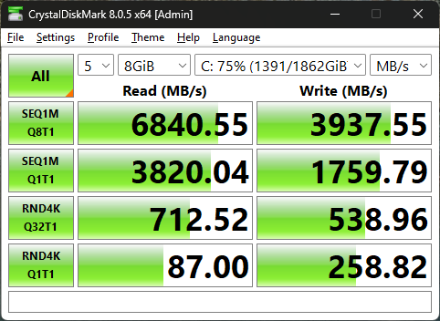

# mauder
This is a MAUDE data scraper for consolodating device data based on product code.

The utility will search subdirectories for any available information for the product codes provided, merge the data into a single file, and provide a summary of the problems encountered.

# Input Data

Maude data can be downloaded from the FDA's [MDR Data Files](https://www.fda.gov/medical-devices/medical-device-reporting-mdr-how-report-medical-device-problems/mdr-data-files).

The data downloaded from the website should be placed as indicated in the structure below.

```
.
└── mdr-data-files/
    ├── device
    |   ├── DEVICE.txt
    |   ├── DEVICE2023.txt
    |   ├── DEVICE2022.txt
    |   ├── ...
    |   └── DEVICEChange.txt
    ├── foitext
    |   ├── foitext.txt
    |   ├── foitext2023.txt
    |   ├── ...
    |   └── foitextChange.txt
    ├── patientproblemcode
    |   └── patientproblemcode.txt
    ├── patientproblemdata
    |   └── patientproblemcodes.csv
    └── mdrfoi
        ├── mdrfoiThru2025.txt
        └── mdrfoiChange.txt
```


NOTE: the 'patientproblemdata.zip' archive contains the file named 'patientproblemcodes.csv'.

This utility will scan all available files.  Only include data as far back as you need or it may take a long time to run.

Maude "add" files (e.g. deviceadd.txt) are not parsed.  These files contain the additions for the current month.

# Output Data
An output folder is created in the script directory and two files are going to be created for a run.

The first file is all of the data stiched together into a single tab delimited file.

The second file is a summary of what was run and a breakdown of issues based on the problems reported.  This summary is printed out to terminal as well.


# Mauder Output Quirks
Mauder is report based.  A quirk of this decision is that in the event that multiple patients are involved in the report, it shows up as a single line item in the output.  You will be able to distinguish how many individuals were involved in the report by looking at the `PATIENT_SEQUENCE_NO` column.  Most of the time (but not always) this sequence number starts at 1, so if you only see 1's in that column there was only one person involved.  If you see a 0 in the column, it means you are in the "some of the time" category of patient indexing.

Another quirk is a report can have multiple patient problems associated with it, so it is not uncommon to see the same `PATIENT_SEQUENCE_NO` repeated multiple times for a given line with multiple problems listed in the next column over.  Pretty much anything that is being scraped from the `patientproblemcode.txt` file has the opportunity to look funny because of the way that data is tracked in the MAUDE database.

Lastly there are "changes".  For the DEVICE, foitext, and the patient files there are separate files that have updates to "the existing base records".  That stuff will get tacked on with the word "change:" in the locations where some more data was added.

# Performance
Note: PyPy is consistently and significantly slower than CPython for this program.  If you are a PyPy user, consider using CPython for this program.

Current performance on a i7-13700k with a Samsung 980 PRO NVMe is below.

Product code OYC

A note about the numbers below.  The "Raw Reading" is only using a single thread to read read through each line of the files without doing any processing of the line.  The "File Parsing" is using processing pool with all the logical cores performing the parsing.  The program is run twice to generate these numbers so the file cache is hot.

```
MODE                TIME (s)            THROUGHPUT GB/s     EFFICIENCY
Raw Reading         4.418               3.232               100.00%
File Parsing        2.690               5.307               164.20%
Multiprocessing pool size               24
Time to write maude file                0.312s
Time to summarize date                  0.021s
Time to write summary                   0.003s
Total processing time                   3.027s
Total size of processed files           14.278 GB
```




Dataset retrieved July 2025:
- DEVICE.txt
- DEVICE2022.txt
- DEVICE2023.txt
- DEVICE2024.txt
- DEVICEChange.txt
- deviceproblemcodes.csv
- foitext.txt
- foitext2022.txt
- foitext2023.txt
- foitext2024.txt
- foitextChange.txt
- patientproblemcode.txt

# Other Stuff
Multiprocessing reports the number of logical cores available on the system, not the number of physical cores.  Running Mauder with all of the logical cores doesn't improve performance over using just the physical cores so it seems dumb to be using anything more than the number of physical cores.  However, having an external dependancy on `psutil` just to get an accurate number of physical cores in a system seems dumber.  Use the `-p` option to have Mauder use whatever you want for a Pool size if the number of logical cores doesn't jive with you.

# Versioning
Version numbers are arbitrary.  I bump it when some bugs are fixed, performance is improved, or some feature has been added and I feel like it's good enough for a new number.
